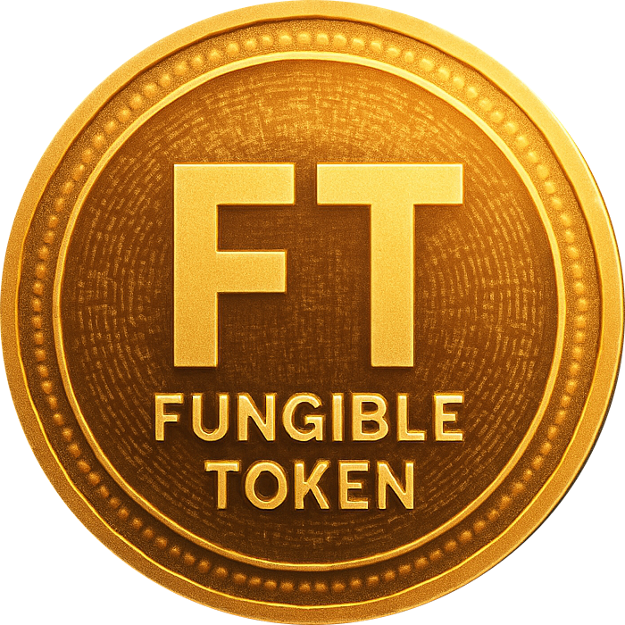
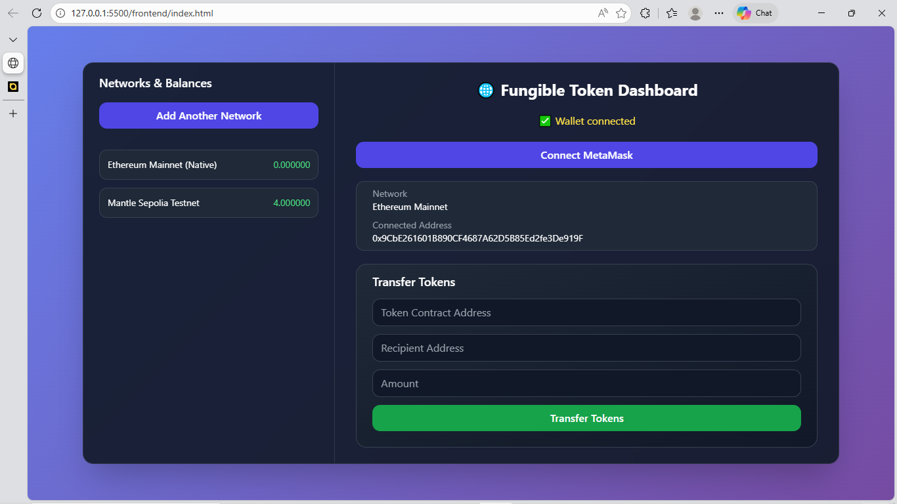

#  Fungible Token

A minimal **Solidity + HTML + Tailwind CSS decentralized application** that   demonstrates wallet connection and token transfers using a custom ERC-20-like smart contract.
Built for **hackathons and buildathons**, focusing on clarity, correctness, and on-chain logic.

<br>

## 🚀 Project Overview

**Fungible Token** allows users to:

- Connect with wallet using MetaMask  
- View your token balance  
- Transfer tokens to any valid address  
- Interact directly with a deployed Solidity smart contract
- Learn core dApp concepts with minimal abstraction  

<br>

## 📸 Screenshot


<br>

## 📁 Project Structure
```

fungible-token/
│
├── assets/
│   ├── token_images.png
│   └── Screenshot.png
│
├── contracts/
│   └── MyToken.sol        # ERC-20–like Solidity smart contract
│
├── frontend/
│   ├── index.html         # HTML + Tailwind CSS UI
│   └── app.js             # Wallet connection & contract interaction
│
└── README.md

```

<br>

## 🧾 Smart Contract

- Language: Solidity `^0.8.17`
- Standard: ERC-20–inspired (custom implementation)
- Features:
  - Token minting (owner-only)
  - Balance tracking
  - Token transfers
  - Total supply tracking
  - Overflow-safe arithmetic (Solidity 0.8+)

⚠️ The smart contract must be deployed before the frontend can interact with it.

<br>

## 🔧 Deployment Options

You can deploy MyToken.sol using:

- Remix IDE (recommended for quick demos)
- Mantle Sepolia Testnet
- Local development networks
  - Hardhat
  - Anvil
  - Ganache


<br>

## 🧪 How to Run the Project

1. Deploy `MyToken.sol`
2. Copy the deployed contract address
3. Paste it into `frontend/app.js`
4. Open `frontend/index.html` in a browser
5. Connect MetaMask
6. Start interacting with the smart contract

<br>

## 🛠 Tech Stack

- **Solidity** – Smart contract logic  
- **HTML** – Structure  
- **Tailwind CSS** – Styling  
- **Javascript (app.js)** – Blockchain interaction via ethers.js / web3
- **MetaMask** – Wallet provider  

<br>

## 🏆 Hackathon Ready

This project follows best practices for:
- **Best suited for beginner to intermediate level hackathons and academic labs**, where the focus is on understanding core Solidity concepts, token mechanics, and on-chain logic rather than full protocol complexity.

- **Demonstrates fundamental fungible token architecture**, including balance tracking, controlled minting, total supply management, and peer-to-peer transfers.

- **Uses secure and modern Solidity practices** (^0.8.17) with built-in overflow protection and explicit permission checks.

- **Clean, minimal, and extensible design**, making it ideal for audits, viva explanations, and future upgrades toward full ERC-20 compliance.

<br>

## 📌 Notes

- Ensure MetaMask is installed
- Ensure the correct blockchain network is selected
- Only the contract owner can mint new tokens
- Token transfers are fully on-chain and irreversible

<br>

## 📄 License

This project is licensed under the MIT License.
